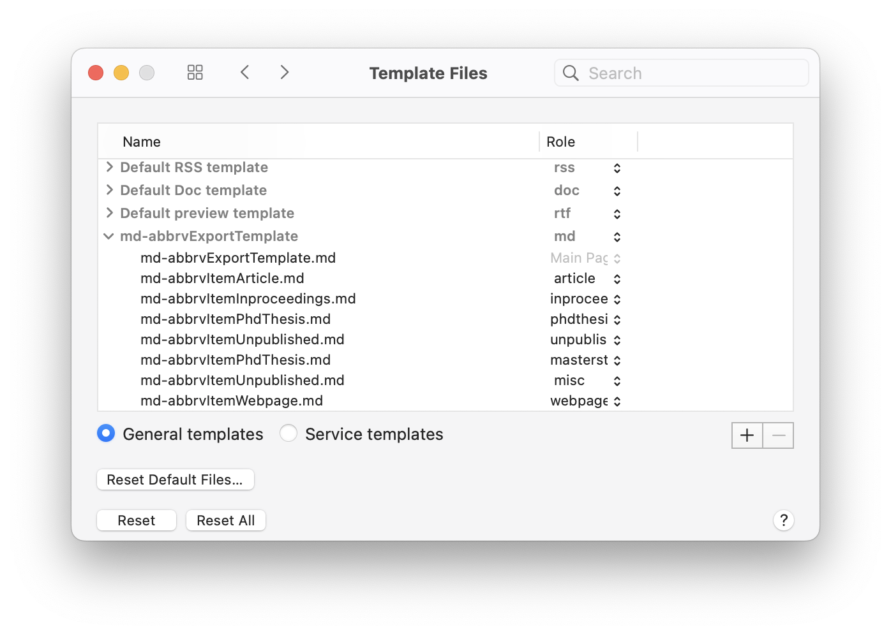

# bibdesk-bibtex-markdown
A BibDesk Template to export to BibTeX entries to Markdown (with linky titles!)

[BibDesk](http://bibdesk.sourceforge.net) is a bibliography management tool for
Mac OS X that uses BibTeX as its source files. One of my favourite features is copying records to a variety of formats using [templates](https://sourceforge.net/p/bibdesk/wiki/Templates/ "BibDesk template wiki").

New templates can be added to BibDesk in Preferences->Templates.

The Markdown export template that you can build from this repository's files
works on various BibTeX types, and it turns the title into a link if the Url
field is working correctly (more details below). BibDesk also handles LaTeX
accents if they are enclosed in {}, so that r{\'e}sum{\'e} exports as résumé.

You use it simply by selecting the records you want to export, right click, and use Copy Using Template -> The Markdown Template. That's what's happening in the screenshot below.


For the example I chose to export several types of records at the same time:
article, inproceedings, misc, phdthesis, unpublished.

Here is some sample output:

* [@Sloane2010](@Sloane2010.md): N. J. A. Sloane. *A022567, Expansion of Product $(1 + q^m)^2; m=1..\infty$*. 2010.
* [@EricksonRuskey2013c-mypubs](@EricksonRuskey2013c-mypubs.md): A. Erickson and F. Ruskey. [*Enumerating maximal tatami mat coverings of square grids with $v$ vertical dominoes*](http://arxiv.org/abs/1304.0070). Manuscript in preparation, 2013.
* [@EricksonRuskey2014](@EricksonRuskey2014.md): A. Erickson and F. Ruskey. [*Generating Tatami Coverings Efficiently*](http://arxiv.org/abs/1403.4776). Proc. of the international conference Génération Aléatoire de Structures Combinatoires (GASCom), Bertinoro, Italy, 2014.
* [@WangEricksonFan2015](@WangEricksonFan2015.md): X. Wang, A. Erickson, J. Fan, and X. Jia. [*Hamiltonian Properties of DCell Networks*](http://comjnl.oxfordjournals.org/content/58/11/2944.abstract). The Computer Journal, 58(11):2944--2955, 2015.
* [@Erickson2013a](@Erickson2013a.md): A. Erickson. [*Monomino-Domino Tatami Coverings*](http://hdl.handle.net/1828/4902). University of Victoria, 2013.


### Below is the (cleaned) source  for those entries ###

```
@article{WangEricksonFan2015,
	Author = {Wang, Xi and Erickson, Alejandro and Fan, Jianxi and Jia, Xiaohua},
	Doi = {10.1093/comjnl/bxv019},
	Journal = {The Computer Journal},
	Number = {11},
	Pages = {2944--2955},
	Title = {{H}amiltonian Properties of {DC}ell Networks},
	Url = {http://comjnl.oxfordjournals.org/content/58/11/2944.abstract},
	Volume = {58},
	Year = {2015},
	Bdsk-Url-1 = {http://comjnl.oxfordjournals.org/content/58/11/2944.abstract},
	Bdsk-Url-2 = {http://dx.doi.org/10.1093/comjnl/bxv019}}

@inproceedings{EricksonRuskey2014,
	Author = {Alejandro Erickson and Frank Ruskey},
	Booktitle = {Proc. of the international conference G{\'e}n{\'e}ration Al{\'e}atoire de Structures Combinatoires (GASCom), Bertinoro, Italy},
	Month = {June},
	Note = {8 pages},
	Timestamp = {2014.11.06},
	Title = {Generating Tatami Coverings Efficiently},
	Url = {http://arxiv.org/abs/1403.4776},
	Year = {2014},
	Bdsk-Url-1 = {http://arxiv.org/abs/1403.4776}}

@misc{Sloane2010,
	Author = {N. J. A. Sloane},
	Howpublished = {Published electronically at \url{http://oeis.org}, The On-Line Encyclopedia of Integer Sequences},
	Title = {A022567, Expansion of Product $(1 + q^m)^2; m=1..\infty$},
	Year = {2010}}

@phdthesis{Erickson2013a,
	Address = {Canada},
	Author = {Alejandro Erickson},
	Month = {August},
	School = {University of Victoria},
	Title = {Monomino-Domino Tatami Coverings},
	Url = {http://hdl.handle.net/1828/4902},
	Year = {2013},
	Bdsk-Url-1 = {http://hdl.handle.net/1828/4902}}

@unpublished{EricksonRuskey2013c-mypubs,
	Author = {Erickson, Alejandro and Ruskey, Frank},
	Note = {Manuscript in preparation},
	Title = {Enumerating maximal tatami mat coverings of square grids with $v$ vertical dominoes},
	Url = {http://arxiv.org/abs/1304.0070},
	Year = {2013},
	Bdsk-Url-1 = {http://arxiv.org/abs/1304.0070}}
```

### This is how I set up my BibDesk template preferences ###



### Getting URLs to work ###

BibDesk converts URLs found the the Url field on start up, so if your URLs are not working, close and open the BibTeX file (BibDesk itself doesn't need to be restarted).

### Things you might want to change ###

Due to my own preferences, the output has the following idiosyncracies:

  * Output is a list; items start with a *
  * Cite keys are listed first, prefixed with an @ symbol, and styled as
    Markdown links to a Markdown file of the same name.
  * Authors appear on the same line as everything else.
  * Authors appear as "J. Doe"
  * *Titles are in italics*
  * Titles are hyperlinked if a link exists (and the link address is not
    displayed anywhere)

Note that the white space in the templates is important. If newlines are added
in certain places, then unwanted spaces might be added when certain fields are
empty.

File -> New Template is very useful for discovering how to write templates.

The template source is not pretty to look at, but here is an example:

```
* [@<$citeKey/>](@<$citeKey/>.md): <$authors.abbreviatedName.stringByDeTeXifyingString.stringByRemovingCurlyBraces.@componentsJoinedByCommaAndAnd/>. <$remoteURLs.URL?>[</$remoteURLs.URL?>*<$fields.Title.stringByDeTeXifyingString.stringByRemovingCurlyBraces/>*<$remoteURLs.URL?>](<$remoteURLs.URL.absoluteString.@firstObject/>)</$remoteURLs.URL?>. <$fields.Journal.stringByDeTeXifyingString.stringByRemovingCurlyBraces.stringByAppendingCommaAndSpaceIfNotEmpty/><$fields.Volume/><$fields.Number.parenthesizedStringIfNotEmpty/><$fields.Pages?>:<$fields.Pages.stringByAppendingCommaAndSpaceIfNotEmpty/></$fields.Pages?><$fields.Year/>.
```

### Other ways of converting BibTeX to Markdown ###

I made these templates because I was dissatisfied with the output of
[Pandoc](http://pandoc.org), and I wanted a simpler, one step solution.

There is, in fact, a template that offers
[pandoc integration in BibDesk](https://github.com/dsanson/bibdesk-pandoc-export-templates),
and it might be worth checking out.

### Issues ###

  * Page ranges 8--10 that use two dashes don't convert to single dashes
    automatically.
